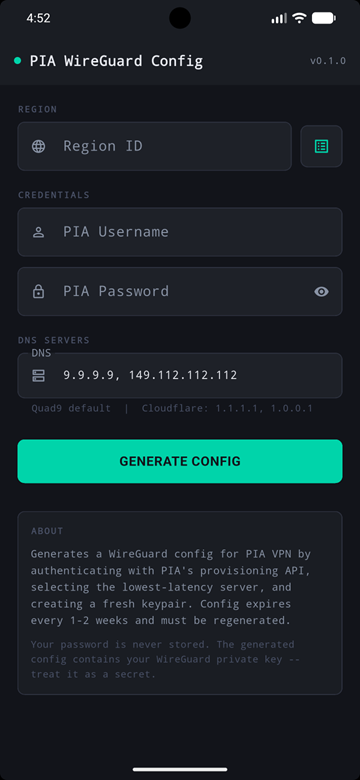

# pia-wireguard-cfga Flutter Android App

GUI Android APK equivalent of https://github.com/ExponentiallyDigital/pia-wireguard-cfg

Implements the identical PIA WireGuard provisioning flow as the Go CLI tool,
in a native Android GUI using Flutter/Dart.



## To Do

1. update README.md, elaborate release zip file, update output section, add app image
2. fix release.yaml script (remove parts of gitignore)
3. fix app name convention
4. refactor versioning (currently in 2 places)
5. create homescreen icon on install

## Setup

### Prerequisites

- Flutter SDK 3.10 or later: https://flutter.dev/docs/get-started/install
- Android Studio with Android SDK
- A connected Android device or emulator

### Install dependencies

```
flutter pub get
```

### Run on connected device

```
flutter run
```

### Build release APK

```
flutter build apk --release
```

Output: `build/app/outputs/flutter-apk/app-release.apk`

### Install APK via adb

```
adb install build/app/outputs/flutter-apk/app-release.apk
```

or sideload via your favorite app.

## How it works

The provisioning logic in `lib/pia_service.dart` is a direct Dart translation
of the Go code in main.go, implementing the same steps in the same order:

1. Fetch PIA server list from serverlist.piaservers.net/vpninfo/servers/v6
   - Splits on first newline to discard the signature portion (same as Go)
2. Measure TCP latency to port 1337 on each candidate server
3. Authenticate via HTTP Basic Auth POST to PIA token API
4. Generate WireGuard keypair using X25519 with RFC 7748 scalar clamping
   (k[0] &= 248, k[31] &= 127, k[31] |= 64)
5. Fetch PIA CA certificate dynamically from pia-foss/manual-connections
   (never hardcoded -- stays current if PIA rotate it)
6. Register public key with lowest-latency server via HTTPS to port 1337,
   using PIA CA cert with ServerName set to the server CN (not IP)
7. Assemble config with Unix line endings, stripping any \r characters

## Output

The generated config is:

- Displayed in the app for review
- Auto-saved to the app's documents directory
- Shareable via Android's share sheet (use "Save to Files", send via email, etc.)
- Copyable to clipboard

## Notes

- The config expires every 1-2 weeks due to PIA's dynamic registration model
- Your password is never stored -- it is used only to obtain a short-lived token
- The generated config contains your WireGuard private key -- treat it as a secret
- Requires internet access for all API calls

## Package dependencies

| Package         | Purpose                                        |
| --------------- | ---------------------------------------------- |
| `http`          | HTTP calls to PIA APIs                         |
| `x25519`        | WireGuard keypair generation                   |
| `path_provider` | App documents directory                        |
| `share_plus`    | Share/save config file via Android share sheet |

## Contributing

Contributions are welcome. To contribute:

1. Fork the repository
2. Create a feature branch
3. Make your changes
4. Ensure the code passes `go vet` cleanly
5. Submit a pull request with a clear description of the change

## Bugs and feature requests

Found a bug or want to request a feature?
[Open an issue here](https://github.com/ExponentiallyDigital/pia-wireguard-cfga/issues)

## Support

This tool is unsupported and may cause objects in mirrors to be closer than they appear. Batteries not included.

## License

This program is free software: you can redistribute it and/or modify it under the terms of the GNU General Public License as published by the Free Software Foundation, either version 3 of the License, or (at your option) any later version.

This program is distributed in the hope that it will be useful, but WITHOUT ANY WARRANTY; without even the implied warranty of MERCHANTABILITY or FITNESS FOR A PARTICULAR PURPOSE. See the GNU General Public License for more details.

You should have received a copy of the GNU General Public License along with this program. If not, see <https://www.gnu.org/licenses/>.

/Copyright (C) 2026 Andrew Newbury
